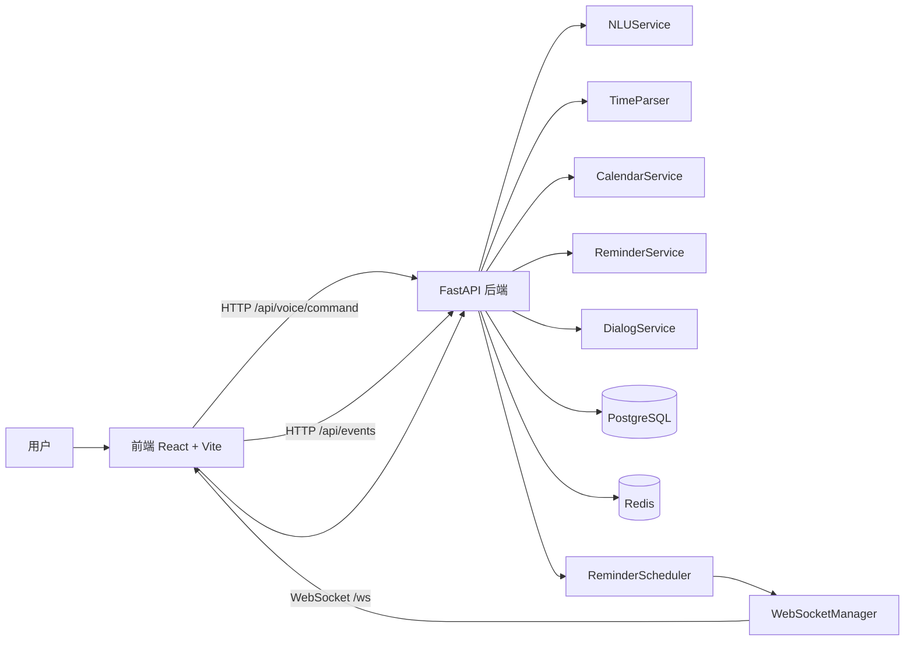

# Xiyangyang Clock 交付文档

## 1. 项目简介

Xiyangyang Clock 是一个语音驱动的日程管理系统，核心目标是把“语音输入 -> 语义理解 -> 日程操作 -> 提醒通知 -> 结果播报”串成一条可用的闭环。

系统支持：

- 语音创建日程
- 语音查询日程
- 语音删除和修改的候选确认
- 到点提醒
- WebSocket 在线推送
- 文字回复与 TTS 播报

## 2. 技术栈

- 前端：React、TypeScript、Vite、Tailwind CSS、shadcn/ui、FullCalendar
- 后端：FastAPI、Uvicorn
- 数据库：PostgreSQL
- 缓存与在线状态：Redis
- ORM：SQLAlchemy async
- 配置管理：pydantic、pydantic-settings
- 时间解析：dateparser、python-dateutil、rrule
- 调度：APScheduler
- HTTP 客户端：httpx
- 容器化：Docker、docker-compose

## 3. 系统架构



说明：

- 前端负责语音输入、日历展示、确认 UI、WebSocket 状态、TTS 播报。
- FastAPI 负责语音命令入口、事件与提醒 REST API、WebSocket、健康检查。
- PostgreSQL 保存事件、提醒、对话状态和语音日志。
- Redis 保存会话状态、待确认状态和 WebSocket 在线状态。
- 提醒调度器当前随后端 API 进程启动，定时扫描待提醒数据并推送 WebSocket 消息。

## 4. 本地启动方式

### 4.1 后端

进入后端目录：

```powershell
cd backend
```

复制环境变量示例：

```powershell
Copy-Item .env.example .env
```

安装依赖：

```powershell
python -m venv .venv
.venv\Scripts\Activate.ps1
python -m pip install --upgrade pip
pip install -r requirements.txt
```

初始化数据库：

```powershell
python -m scripts.init_db
```

启动后端：

```powershell
uvicorn app.main:app --reload --host 0.0.0.0 --port 8000
```

### 4.2 前端

进入前端目录：

```powershell
cd frontend
```

复制环境变量示例：

```powershell
Copy-Item .env.example .env
```

安装依赖并启动：

```powershell
npm install
npm run dev
```

默认前端地址：

```text
http://localhost:5173
```

## 5. Docker 启动方式

根目录复制 Docker 环境变量示例：

```powershell
Copy-Item .env.example .env
```

至少修改：

- `POSTGRES_PASSWORD`
- `JWT_SECRET`

启动全部服务：

```powershell
docker compose up --build
```

如果本机 Docker CLI 不支持 `docker compose` 子命令，可以使用：

```powershell
docker-compose up --build
```

Docker 服务说明：

- `postgres`：PostgreSQL 数据库
- `redis`：Redis 缓存与在线状态
- `db-init`：数据库初始化任务
- `api`：后端 FastAPI 服务
- `frontend`：前端静态站点与反向代理

访问地址：

- 前端：`http://localhost:5173`
- 后端健康检查：`http://localhost:8000/api/health`
- PostgreSQL：`localhost:5432`
- Redis：`localhost:6379`

## 6. 环境变量说明

### 6.1 后端运行环境

| 变量 | 说明 |
| --- | --- |
| `APP_ENV` | 运行环境标识，默认 `dev`，Docker 中通常为 `docker` |
| `APP_NAME` | 应用名称 |
| `DATABASE_URL` | PostgreSQL 连接串 |
| `REDIS_URL` | Redis 连接串 |
| `JWT_SECRET` | JWT 或签名密钥 |
| `TIMEZONE` | 默认时区 |
| `OPENAI_API_KEY` | OpenAI 接入密钥，可为空 |
| `WS_HEARTBEAT_INTERVAL` | WebSocket 心跳间隔，单位秒 |
| `REMINDER_SCAN_INTERVAL` | 提醒扫描间隔，单位秒 |

### 6.2 前端运行环境

| 变量 | 说明 |
| --- | --- |
| `VITE_API_BASE_URL` | 前端请求后端 API 的基础地址 |
| `VITE_WS_URL` | WebSocket 地址 |

### 6.3 Docker 运行环境

| 变量 | 说明 |
| --- | --- |
| `POSTGRES_DB` | PostgreSQL 数据库名 |
| `POSTGRES_USER` | PostgreSQL 用户名 |
| `POSTGRES_PASSWORD` | PostgreSQL 密码 |
| `POSTGRES_PORT` | 主机映射的 PostgreSQL 端口 |
| `REDIS_PORT` | 主机映射的 Redis 端口 |
| `API_PORT` | 主机映射的后端端口 |
| `FRONTEND_PORT` | 主机映射的前端端口 |
| `COMPOSE_PROJECT_NAME` | Compose 项目名 |

## 7. 数据库初始化方式

### 7.1 本地开发

后端目录执行：

```powershell
python -m scripts.init_db
```

该脚本会根据 SQLAlchemy `Base.metadata.create_all` 创建当前模型对应的表：

- `users`
- `events`
- `reminders`
- `conversation_states`
- `voice_commands`

### 7.2 Docker

`docker compose up --build` 时，`db-init` 服务会先执行初始化脚本，再启动 API 服务。

## 8. 测试命令

### 8.1 后端测试

在 `backend` 目录下执行：

```powershell
python -m unittest discover -s tests -p "test_*.py"
```

### 8.2 前端构建检查

在 `frontend` 目录下执行：

```powershell
npm run build
```

### 8.3 Docker 配置检查

在仓库根目录执行：

```powershell
docker-compose config --quiet
```

## 9. 演示场景

### 9.1 语音添加日程

用户输入：

```text
明天下午三点提醒我交项目文档
```

预期结果：

- 系统识别创建日程意图
- 若信息完整，则创建事件和提醒
- 返回自然语言回复并写入日志

### 9.2 语音查询今天安排

用户输入：

```text
我今天有什么安排
```

预期结果：

- 系统默认查询今天
- 按时间顺序播报当天安排
- 若当天无安排，返回“暂无安排”

### 9.3 缺少时间时系统追问

用户输入：

```text
提醒我交项目文档
```

预期结果：

- 系统发现缺少时间信息
- 保存 conversation_state
- 返回追问，例如“请告诉我具体时间”

### 9.4 删除日程前确认

用户输入：

```text
删除明天的会议
```

预期结果：

- 系统查找候选日程
- 若唯一匹配，进入确认状态
- 返回“请确认是否删除...”

### 9.5 修改日程前确认

用户输入：

```text
把下周三的会改到周四下午两点
```

预期结果：

- 系统查找候选日程并解析修改字段
- 若唯一匹配，进入确认状态
- 返回修改确认文案

### 9.6 到点提醒和语音播报

预期流程：

- 创建一个 1 分钟后触发的提醒
- 等待提醒调度器扫描
- 后端通过 WebSocket 推送 `reminder_triggered`
- 前端弹出提醒并播报 TTS

